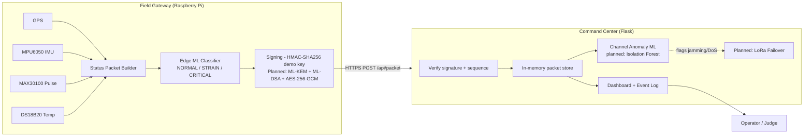
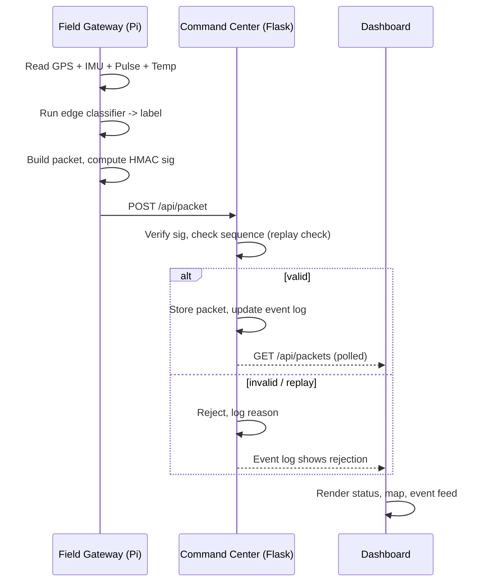

# Q-SHIELD — Command Center


> Track: Cybersecurity & Defense · ASYNC 2026 · Team Wire_we_here

---

## 1. Context & Overview

### Elevator pitch
Field operatives transmit mission-critical status — location, movement, physical condition — to command over wireless links that can be intercepted, replayed, spoofed, or jammed. Encrypted traffic recorded today can also be decrypted later once quantum computers break RSA/ECC ("harvest-now-decrypt-later"). **Q-SHIELD** is a Raspberry Pi field gateway + command-center dashboard that classifies an operative's status on-device, authenticates every packet, and is being built toward post-quantum cryptography and channel-level attack detection — so command only ever acts on status data that is genuine, current, and still getting through under attack.

**Target audience:** defense and disaster-response field communications; anyone needing tamper-evident, quantum-resistant telemetry over a constrained link.

**Core features (current prototype):**
- Live field telemetry (GPS, IMU, pulse, temperature) → fused status packet
- On-device ML classifier (NORMAL / STRAIN / CRITICAL) trained on the public HIFD dataset
- Single-page command-center dashboard (Flask + vanilla JS), offline-capable
- Demo mode — simulated packets, no hardware required
- HMAC-signed packets as a placeholder for the planned PQC layer

**Core features (in progress — see [Known Limitations](#troubleshooting--known-limitations)):** ML-KEM/ML-DSA handshake, AES-256-GCM per-packet encryption, command-side channel-anomaly ML, automated LoRa failover.

### Demo & media
- **Live dashboard:** https://async-2cuj.onrender.com/
- **Hardware simulation (Wokwi):** https://wokwi.com/projects/475881167495110657
- **Demo video:** https://youtu.be/JH6prkVOjwI
- **Screenshots:** _add `/docs/screenshots/` and link them here before review_

### Project structure
```
Async/
├── app.py                     # Flask command-center backend
├── templates/, static/        # Command-center dashboard UI
├── models/                    # Trained ML artifacts (see §2 for what each does)
│   ├── qshield_status_classifier.pkl      # field-side NORMAL/STRAIN/CRITICAL classifier
│   ├── channel_randomforest.pkl           # command-side channel-attack classifier
│   └── channel_isolationforest.pkl        # command-side channel-attack anomaly detector
├── data/
│   └── qshield_3class_dataset.csv         # training data behind qshield_status_classifier.pkl
├── field/                     # Raspberry Pi field-gateway code
│   ├── send_to_command.py                 # reads sensors, runs classifier, posts to command center
│   ├── attacker.py                        # replay/tamper/flood demo attack script
│   └── requirements-field.txt
├── training/                  # Reproducible model-training scripts
│   ├── build_3label.py                    # builds qshield_3class_dataset.csv from the HIFD dataset
│   ├── train_3class.py                    # trains qshield_status_classifier.pkl
│   ├── gen_synth.py, build_features.py, train_channel_models.py   # channel-anomaly dataset + training
├── docs/
│   └── Q-SHIELD_Documentation.md
└── .env.example
```
**Note:** these files are present for review completeness; `app.py` does not yet load or call the models in `models/` at runtime — see [Known Limitations](#troubleshooting--known-limitations).

---

## 2. Architecture & System Design

### System architecture


### End-to-end execution flow


### Documentation links
- API endpoint reference: see [§4 Usage Snippets](#usage-snippets) and the table below — no formal OpenAPI/Swagger spec yet (tracked in Known Limitations).
- Dataset + training scripts: `/training/` (3-class HIFD-derived dataset, channel-anomaly synthetic dataset, training notebooks).
- Design background: project write-up in `/docs/`.

---

## 3. Installation & Configuration

### Prerequisites & tech stack
| Component | Requirement |
|---|---|
| Python | >= 3.9 (tested on 3.9–3.12) |
| Flask | 3.x (see `requirements.txt`) |
| Field gateway hardware | Raspberry Pi 4, NEO-6M GPS, MPU6050, MAX30100/30102, DS18B20 |
| Field gateway Python deps | `requests`, `joblib`, `numpy`, `pandas`, `smbus2`, `pyserial` |
| Browser | Any modern browser (Leaflet map requires internet for tiles; falls back to coordinate grid offline) |
| GPU | Not required |

### Step-by-step installation

**Command center (laptop/server):**
```bash
git clone https://github.com/code-silver01/Async.git
cd Async
pip install -r requirements.txt
python app.py
# open http://localhost:5000
```

**Field gateway (Raspberry Pi):**
```bash
pip install requests joblib numpy pandas smbus2 pyserial
# copy your trained classifier (qshield_status_classifier.pkl) onto the Pi
python3 send_to_command.py \
  --server https://async-2cuj.onrender.com \
  --model qshield_status_classifier.pkl \
  --fallback-loc 33.75,78.68
```
Use `--sim` on either machine to run without real hardware.

### Environment variables matrix
| Key | Description | Type | Default | Required |
|---|---|---|---|---|
| `SESSION_KEY` | Pre-shared HMAC key for packet signing (placeholder for ML-KEM/ML-DSA-derived session key) | string | `qshield-demo-session-key` (hardcoded — move to env before review) | Yes |
| `PORT` | Command-center Flask port | int | `5000` | No |
| `FLASK_DEBUG` | Enable Flask debug mode | bool | `false` | No |
| `MODEL_PATH` | Path to the Pi-side classifier `.pkl` | string | — | Yes (field gateway) |
| `COMMAND_SERVER_URL` | Command-center URL the gateway posts to | string | — | Yes (field gateway) |
| `GPS_FALLBACK_LOC` | `lat,lon` used when GPS has no fix | string | none | No |

> **Note:** `SESSION_KEY` is currently hardcoded in both `app.py` and `send_to_command.py` — move it to an environment variable (e.g. via `python-dotenv`) before external review.

---

## 4. Developer Experience & Quality Control

### Usage snippets

**Post a packet (curl):**
```bash
curl -X POST https://async-2cuj.onrender.com/api/packet \
  -H "Content-Type: application/json" \
  -d '{"unit_id":"UNIT_01","seq":1,"ts":"2026-10-01T05:00:00Z",
       "location":{"fix":true,"lat":33.75,"lon":78.68,"sats":9,"src":"GPS"},
       "motion":{"state":"STILL","accel_g":1.0,"peak_g":1.0},
       "vitals":{"finger":true,"bpm":78},
       "status":"ACTIVE","priority":"ROUTINE",
       "security":{"mode":"HMAC-SHA256","note":"demo key"},
       "digest":"", "sig":"<computed>"}'
```

**API reference (current):**
| Method | Path | Description |
|---|---|---|
| POST | `/api/packet` | Submit a status packet |
| GET | `/api/packets` | Return stored packets (up to 200) |
| GET | `/api/latest` | Most recent packet |
| GET | `/api/events` | Event log |
| POST | `/api/demo/start` / `/api/demo/stop` | Toggle simulated packet generator |
| GET | `/api/demo/status` | Demo mode status |

### Testing & QA commands
```bash
# Not yet implemented — tracked below under Known Limitations.
# Planned:
pip install pytest flake8 black
pytest tests/
flake8 .
black --check .
```

---

## 5. Reliability, Performance & Security

### Benchmarks & maturity status
**Maturity: Alpha / Hackathon Prototype.** No formal load-testing or latency benchmarking has been performed yet. Current operating parameters (observed, not benchmarked):
- Packet post interval: ~1s (configurable via `--interval`)
- Dashboard poll interval: ~0.75–1s
- Classifier inference: single-sample `RandomForestClassifier.predict()` on-device, sub-100ms on a Pi 4

### Troubleshooting & known limitations
| Issue | Cause | Workaround / Trade-off |
|---|---|---|
| GPS shows `fix: false` indoors | NEO-6M needs open sky | Use `--fallback-loc lat,lon`, marked `src: MANUAL` |
| `DS18B20 not found` on Pi | 1-Wire not enabled or wiring issue | Enable via `raspi-config`, check `/sys/bus/w1/devices/28-*` |
| sklearn "does not have valid feature names" warning | Classifier predicting on raw array vs DataFrame | Resolved — gateway now passes a named DataFrame |
| Dashboard shows STALE | No packet received in >5s | Check `COMMAND_SERVER_URL`, network, and that the Pi script is running |
| First Render.com load is slow | Free-tier cold start | Expected; not a bug |
| PQC panel shows placeholder | ML-KEM/ML-DSA/AES-256-GCM not yet integrated | HMAC-SHA256 with a pre-shared key stands in for now — **do not represent this as quantum-resistant in review** |
| Channel-anomaly ML not live on command side | Trained separately, not yet wired into `app.py` | Model artifacts exist (`/training/channel_*.pkl`); integration pending |
| LoRa failover is logical only | No physical LoRa radios in current build | Failover logic is simulated in software |
| CRITICAL-class recall ~43% on unseen subjects | Minority class, high inter-subject variance in fall signatures | Retrain on operator-specific data before relying on it live; see `/training/` |
| No automated tests / CI | Not yet set up | Tracked as next step, see §4 |

### Security reporting
This is a hackathon prototype — **do not use in production or with real operational data.** Current authentication is a shared demo key (`SESSION_KEY`), not a secure secret-management setup.

To report a vulnerability or design concern, contact the team lead privately rather than opening a public issue:
**Aditya Goel** — adityagoel2210@gmail.com

---

## 6. Governance & License

### Contribution guidelines
- Branch per feature (`pqc-handshake`, `channel-ml`, `ui-polish`, etc.); avoid committing directly to `main`.
- Keep PQC, ML, and dashboard changes in separate PRs where possible — they're independently testable.
- Follow PEP 8; run `black .` before committing (tooling to be added — see Known Limitations).

### License
Internal prototype — **not for public distribution.** Built for ASYNC 2026 (Cybersecurity & Defense track) by Team Wire_we_here. License to be finalized before any public release.
